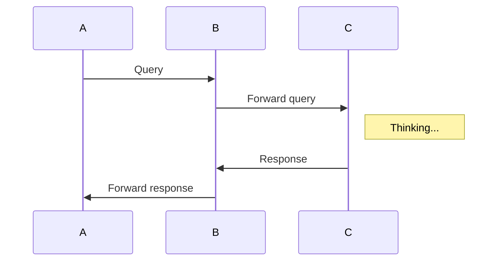
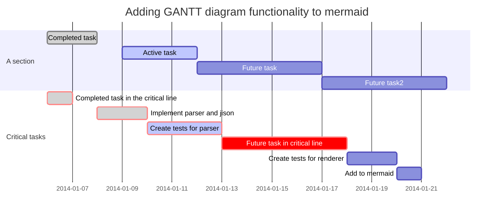

title: 小书匠语法使用手册
tags: 小书匠,语法,MARKDOWN,帮助
--- 
```


## mermaid流程图，序列图，甘特图（[mermaid语法](http://knsv.github.io/mermaid/index.html)）

````markdown

````


## 统计图 （[统计图语法](https://github.com/flot/flot/blob/master/API.md)）
数据格式为：`{"data": [], "options":{}}`
系统使用[jquery.parseJSON()](http://api.jquery.com/jquery.parsejson/)函数进行解析，因此代码必须符合该函数的要求才能正常解析。
````markdown
```plot!
{
"data": [ [[0, 0], [1, 1]] ],
"options": { "yaxis": { "max": 1 } }
}
```
````


## 自定义class
```` markdown
## 自定义class {class名称}
````
通过自定义的class名称后，你就可以在每篇文章的自定义css里添加自己想要的样式了．


## cjk强调
``` markdown
_这里将显示带有衬线字体效果的中文做为强调_
```


## cjk注音标示
``` markdown
{需要被注音标示的内容}(注音标示)
{需要被注音标示的内容}[编号]
[编号]: 注音标示
```


## 居中显示文字
```markdown
->居中显示的文字<-
```


## 对齐显示文字

```markdown
:>居左显示的文字<-
->居右显示的文字<:
:>两端对齐显示的文字<:
->居中显示的文字<-
```
注： 该语法与center语法冲突，两种语法同时开启时，align语法将覆盖center语法。

----------


___

# 示例


___

[toc]


http://www.github.com/suziwen/markdownxiaoshujiang
http://www.xiaoshujiang.com

# 这是 H1 一s级标题
## 这是 H2 二级标题
### 这是 H3 三级标题
#### 这是 H4 四级标题
##### 这是 H5 五级标题
###### 这是 H6 六级标题

### 视频
%[电影](http://markdown.xiaoshujiang.com/media/movie.ogg)

### 音频
~[音乐](http://markdown.xiaoshujiang.com/media/horse.ogg)

### 附件
=[附件](./jianzhu.jpg)

### 待办事项
- [ ] 未完成事项
- [x] 完成事项
- [X] 完成事项

### 缩写定义

The HTML specification
is maintained by the W3C.

*[HTML]: Hyper Text Markup Language
*[W3C]:  World Wide Web Consortium

### 印刷字替换

(c) (C) (r) (R) (tm) (TM) (p) (P) +-

### html代码

<div>html代码</div>

### 流程图 ([语法](http://adrai.github.io/flowchart.js/))

```flow
st=>start: 开始
e=>end: 结束
op=>operation: 操作步骤
cond=>condition: 是 或者 否?

st->op->cond
cond(yes)->e
cond(no)->op
```

### 序列图 ([语法](https://github.com/bramp/js-sequence-diagrams/blob/master/src/grammar.jison))

```sequence
小明->小李: 你好 小李, 最近怎么样?
Note right of 小李: 小李想了想
小李-->小明: 还是老样子
```

### 脚注[^1x]

[^1x]: 脚注的用法

### 表格Tables

First Header  | Second Header
------------- | -------------
Content Cell  | Content Cell
Content Cell  | Content Cell

### 定义

苹果
: 一种水果
: 一种品牌，计算机，手持设备

桔子
: 一种水果

### 文字格式

**这是文字粗体格式**

__这是文字粗体格式__

*这是文字斜体格式*

_这是文字斜体格式_

~~在文字上添加删除线~~

++插入的文字++

==被记号的文字==

上角文字: 19^th^

下角文字: H~2~O

### 无序列表

* 项目1
  * 子项目1.1
  * 子项目1.2
    * 子项目1.2.1
* 项目2
* 项目3

### 有序列表

1. 项目1
2. 项目2
3. 项目3
    1. 项目3.1
    2. 项目3.2

### 有序列表起始编号

58. 项目5
2. 项目6

### 图片


链接

[链接名称](http://xiaoshujiang.com)
### 引用

> 第一行引用文字
> 第二行引用文字
### 水平线

***
### 代码

#### 行内代码

`var x = "hello world"`

#### 块代码

```java
/**
 * @author John Smith <john.smith@example.com>
 * @version 1.0
*/
package l2f.gameserver.model;

import >>++java.util.ArrayList++<<;

>>~~public abstract class L2Character {~~<<
>>++public abstract class L2Character extends L2Object {++<<
  public static final Short ABNORMAL_EFFECT_BLEEDING = 0x0_0_0_1; // not sure

  public void moveTo(int x, int y, int z) {
    _ai = null;
    _log.warning("Should not be called");
    if (1 > 5) {
      return;
    }
  }

  /** Task of AI notification */
  @SuppressWarnings( { "nls", "unqualified-field-access", "boxing" })
  >>==public class NotifyAITask implements Runnable {
    private final CtrlEvent _evt;

    List<String> mList==<< = new ArrayList<String>()

    public void run() {
      try {
        getAI().notifyEvent(_evt, _evt.class, null);
      } catch (Throwable t) {
        t.printStackTrace();
      }
    }
  }
}
```
## 块代码内文字格式
### 块代码高亮标记
```javascript
  var >>==hello==<< = 'hello world'
```
### 块代码删除线
```javascript
  var >>~~hello~~<< = 'hello world'
```
### 块代码加粗
```javascript
  var >>**hello**<< = 'hello world'
```
### 块代码下横线
```javascript
  var >>++hello++<< = 'hello world'
```

### 显示行号
``` javascript?linenums
var x = 1;
var z = 'str';
```

### 高亮指定行
``` javascript?linenums&fancy=1,3,5
var x = 1;
var y = 2;
var z = 3;
var u = 4;
var w = 5;
var a = 6;
```

### 显示行号并从指定行数计数
``` javascript?linenums=10
var x = 1;
```

### 禁用显示行号
``` javascript?linenums=false
var x = 1;
```

### 公式
#### 行内公式
这是行内公式`!$ \Gamma(z) = \int_0^\infty t^{z-1}e^{-t}dt\,. $`
#### 块公式
```mathjax!
$$\Gamma(z) = \int_0^\infty t^{z-1}e^{-t}dt\,.$$
```

#### 带编号的公式
`!$\eqref{ref1}$`

```mathjax!
\begin{equation}
\int_0^\infty \frac{x^22}{e^x-1}\,dx = \frac{\pi^4}{15}\label{ref1}
\end{equation}
```

`!$\eqref{ref1}$`
### 统计图
```plot!
{
"data": [ [[0, 0], [1, 1]] ],
"options": { "yaxis": { "max": 1 } }
}
```

### mermaid流程图，序列图，甘特图


#### 流程图


#### 序列图



#### 甘特图


### PPT语法

使用
```
 
 ----
 
```
作为一个水平页分割线，注意在`----`前后都需要空一行

使用
```
 
 --
 
```
作为一个垂直页分割线, 注意在`--`前后都需要空一行

通过如下形式
```
<!-- .element: class="fragment" data-fragment-index="1" -->
```
可以实现fragment显示效果

注：　在演示文档模式下，`toc`和脚注语法将失效.


### emoji表情[语法](https://github.com/twitter/twemoji)

> Classic markup: :wink: :crush: :cry: :tear: :laughing: :yum:
>
> Shortcuts (emoticons): :-) :-( 8-) ;)

### 自定义class

#### 自定义class用例{green}

你可以通过查看生成的html代码里，在h4里找到名为`green`的class名称．

### cjk强调

#### _这里将显示中文衬线字体做为强调样式_

### cjk注音标示

{小}(xiao){书}(shu){匠}(jiang)

### 居中显示

->居中显示的{文字}(wenzi)<-

-><-

### 文字对齐

:>居左显示的文字<-

->居右显示的文字<:

:>两端对齐显示的文字<:

->居中显示的文字<-

### 增强型表格
|First Header  | Second Header ||
|First Header  | Second Header | Third Header|
|------------- | -------------|-------------|
表身1Content Cell  | Merge Content Cell||
Content Cell  | Content Cell| Content Cell|

表身2Content Cell  | Merge Content Cell||
Content Cell  | Content Cell| Content Cell|
[表格标题]

